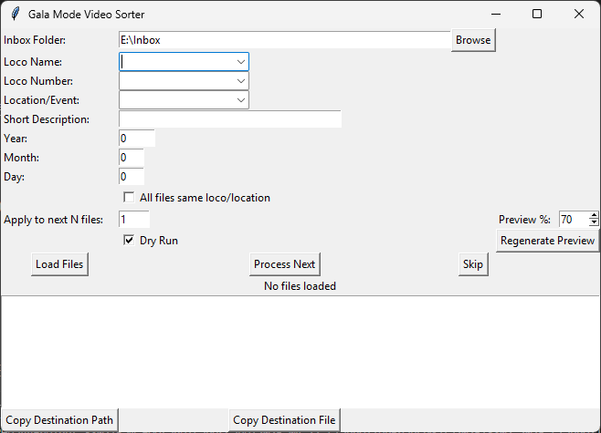

# Video Sorter

A Python-based tool for organising and renaming raw video and image files from railway galas and similar events.  
The sorter processes each file interactively, allowing you to assign locomotive details, event/location, and a short description, while automatically generating folder structures and safe filenames.

---

## Features

- **Interactive file processing**
  - Select locomotive name, number, event/location, date, and short description for each file.
- **Metadata-aware date handling**
  - Extracts recording date from file metadata where available and locks date fields.
  - Falls back to file modified date if metadata is missing (editable).
- **Collision-safe file naming**
  - Automatically appends `_1`, `_2`, etc. to filenames to prevent overwriting.
- **Safe copy/move**
  - Copies file first, verifies size, then deletes original only on success.
- **Meta info preview**
  - Displays file details, destination path, and final filename before processing.
  - Colour-coded for easy status checks.
- **Dry Run mode**
  - Test runs without moving files.
- **Skip files**
  - Skip individual files during processing.
- **Clipboard integration**
  - Copy destination folder or file path with one click.

---

## Requirements

- **Python:** 3.8+
- **Dependencies:**
  - [ffmpeg](https://ffmpeg.org/) (ensure `ffmpeg.exe` and `ffprobe.exe` are installed and paths are set in the script)
  - Python packages:
    ```bash
    pip install pillow
    ```
- **OS:** Windows (tested), should work on other OSes with minor adjustments.

---

## Installation

1. Clone the repository:
```bash
git clone https://github.com/yourusername/gala-mode-video-sorter.git
cd gala-mode-video-sorter
```

2. Install dependencies:

```bash
pip install pillow
```

3. Install [ffmpeg](https://ffmpeg.org/download.html) and update the ffmpeg_exe path in the script.

## Usage 

1. Run the script:

```bash
python gala_mode_sorter.py
```

2. Set Inbox Folder:
Select the folder containing raw video/image files.

3. Process Files:
- Preview the file (default at 70% of the timeline for videos).
- Fill in locomotive details, location, and short description.
- Adjust date if required (unlocked for modified date/manual entries).
- Press Process Next to move the file to its destination.
- Press Skip to skip without processing.

4. Dry Run Mode:
Enable to simulate the process without moving files.

## Example Workflow 



- Load your gala footage folder.
- Assign details for the first clip.
- Review the meta info box for the final filename and destination.
- Process the file — the tool creates the correct folder and safely moves the file.
- Repeat for each clip.


## Folder Structure 

Videos:

```markdown
Videos/
└── LocomotiveName_Number/
    └── Raw Footage/
        ├── Landscape/
        │   └── YYYY-MM-DD_EventName/
        └── Shorts/
            └── YYYY-MM-DD_EventName/
```

Photos: 

```markdown
Photography/
└── LocomotiveName_Number/
    └── Raw Stills/
        └── YYYY-MM-DD_EventName/
```

## Safety Features

- Collision-safe filenames to prevent overwriting.
- Safe move logic: only deletes the original if copy size matches the source.
- Quarantine-ready: code can be adapted to move failed transfers to a quarantine folder.

## Known Limitations

- Large files: Copying large files can appear to “hang” — there’s no progress bar at present.
- No batch metadata editing: Each file is processed individually unless using “Apply to next N files”.
- Recycle Bin bypass: Files deleted by the tool are removed immediately (no recycle bin).
- Windows paths only: Path separators and drive handling assume Windows; adjust for macOS/Linux.


## Future Enhancements 

- Add progress bar for large file moves.
- Optional quarantine folder for all deleted originals.
- Export processing logs.
- Batch processing pre-sets.